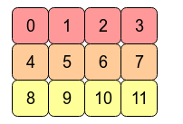
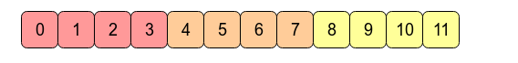

## C-contiguous Arrat
A contiguous array is just an array stored in an unbroken block of memory: to access the next value in the array, we just move to the next memory address.

Consider the 2D array  
arr = np.arange(12).reshape(3,4).   It looks like this:  

In the computer's memory, the values of arr are stored like this:  

This means arr is a C contiguous array because the rows are stored as contiguous blocks of memory. The next memory address holds the next row value on that row. If we want to move down a column, we just need to jump over three blocks (e.g. to jump from 0 to 4 means we skip over 1,2 and 3).